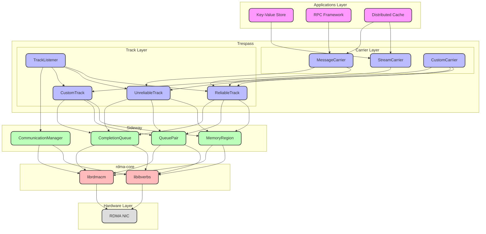

# trespass
A high performance and safe RDMA communication library

```mermaid
flowchart TB
    subgraph Applications["Applications Layer"]
        App1["Key-Value Store"]
        App2["RPC Framework"]
        App3["Distributed Cache"]
    end
    subgraph Trespass["Trespass"]
        direction TB
        subgraph Carriers["Carrier Layer"]
            direction LR
            C1["StreamCarrier"]
            C2["MessageCarrier"]
            C3["CustomCarrier"]
        end
        subgraph Tracks["Track Layer"]
            direction LR
            TL["TrackListener"]
            T1["ReliableTrack"]
            T2["UnreliableTrack"]
            T3["CustomTrack"]
        end
    end
    subgraph Sideway["Sideway"]
        direction LR
        S1["CommunicationManager"]
        S2["MemoryRegion"]
        S3["QueuePair"]
        S4["CompletionQueue"]
    end
    subgraph RDMACore["rdma-core"]
        direction LR
        RC1["libibverbs"]
        RC2["librdmacm"]
    end
    subgraph Hardware["Hardware Layer"]
        HW["RDMA NIC"]
    end
    App1 --> C1
    App2 --> C2
    App3 --> C1 & C2
    C1 --> T1
    C2 --> T1 & T2
    C3 --> T1 & T2 & T3
    TL --> T1 & T2 & T3 & S1
    T1 --> S2 & S3 & S4
    T2 --> S2 & S3 & S4
    T3 --> S2 & S3 & S4
    S1 --> RC1 & RC2
    S2 --> RC1 & RC2
    S3 --> RC1 & RC2
    S4 --> RC1 & RC2
    RC1 --> HW
    RC2 --> HW

    App1:::app
    App2:::app
    App3:::app
    C1:::trespass
    C2:::trespass
    C3:::trespass
    TL:::trespass
    T1:::trespass
    T2:::trespass
    T3:::trespass
    S1:::sideway
    S2:::sideway
    S3:::sideway
    S4:::sideway
    RC1:::rdmacore
    RC2:::rdmacore
    HW:::hw
    classDef app fill:#f9f,stroke:#333,stroke-width:2px,rx:10px
    classDef trespass fill:#bbf,stroke:#333,stroke-width:2px,rx:10px
    classDef sideway fill:#bfb,stroke:#333,stroke-width:2px,rx:10px
    classDef rdmacore fill:#fbb,stroke:#333,stroke-width:2px,rx:10px
    classDef hw fill:#ddd,stroke:#333,stroke-width:2px,rx:10px
```
